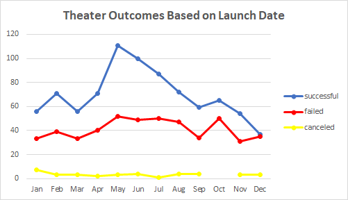
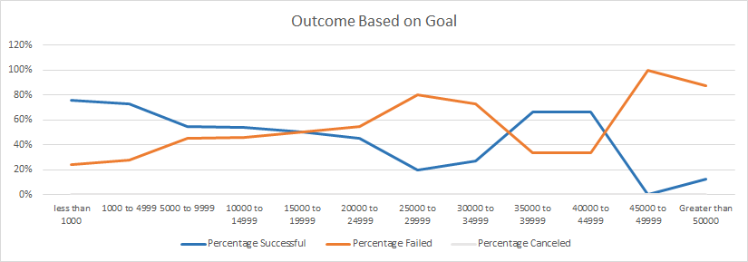

# Kickstarting with Excel

## Overview of Project
This challenge is part of module 1 in the Data Science Bootcamp.
The purpose of this project is to review information provided by previous kickstart campaigns, and to 
determine what insights can be gleamed from a review of the data.  This study involved the use of MS Excel
and targetted data provided from an international source that included campaign types, outcomes, goals, and countries.
By conducting the analysis in Excel, students (like me) in this program are better able to use Excel for detailed data analysis.

### Purpose
In this challenge, we were tasked with identifying conclusions about kickstarter campaigns related to Launch Dates and Goals.
Louise wants to know how different campaigns performed, and what additional information could be deduced based on the data.

## Analysis and Challenges

### Analysis of Outcomes Based on Launch Date

### Analysis of Outcomes Based on Goals

### Challenges and Difficulties Encountered

## Results

- What are two conclusions you can draw about the Outcomes based on Launch Date?

- What can you conclude about the Outcomes based on Goals?

- What are some limitations of this dataset?

- What are some other possible tables and/or graphs that we could create?

